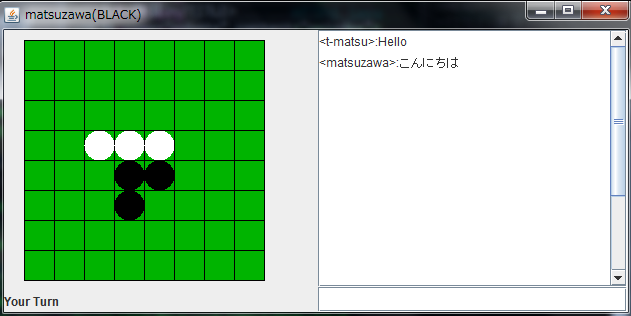

2024年度課題     

2024年度課題
========

以下のプロトコルに準拠したOthelloのクライアントを作成せよ。  

  

1.  ~~上図のようなGUIを使った手動操作クライアントの作成~~
2.  AIを実装したクライアントの作成

以上を実装すること．  
AIクライアントは起動以外に操作することなくゲーム終了まで自動で行えるプログラムとする．

* * *

レポート提出
------

提出期限

2024 7/10(水) 15:00

提出方法

LETUSにて

担当教員

松澤

  

* * *

Othello通信プロトコル
--------------

サーバは，2つのクライアントから接続要求があると，その2つのクライアントでのゲームを開始させる． ゲームの勝敗，黒白反転処理，石が置けるか否か等はすべてサーバで判定するので， クライアントで行う動作は，サーバから送られてくる情報の表示，石を置く位置の送信，チャットメッセージの送受信が行えればよい．  
サーバとクライアント間で用いられる通信はTCPを用いて，以下のメッセージをやりとりする．

*   NICK
*   PUT (ERROR)
*   SAY
*   BOARD
*   TURN
*   END
*   START
*   CLOSE

### NICKメッセージ

クライアントからサーバに送られるメッセージでチャット等に使われるユーザのニックネームを変更する．

NICK username

のように送るとユーザのニックネームがusernameに切り替わる．  
このメッセージはゲームに中にいつでも何度もでも受け付ける．  
クライアントからNICKメッセージが来るまでは，サーバはそれぞれBLACK,WHITEというニックネームを使用する．

### PUTメッセージ

クライアントが石を置く座標を送信する．

PUT 3 2

この例では，横方向に4番目，下方向に3番目の盤上へ，自身の色の石を置く命令になる． PUT命令が正常に処理されると，後述するBOARDメッセージとTURNメッセージが両方のクライアントに送られる．  
正常に処理できない場合はERRORの後に理由の番号がつけられ，クライアントに送られる．

*   ERROR 1  
    書式が間違っているエラー
*   ERROR 2  
    PUT命令で指定した盤目に自身の色の石が置けないエラー
*   ERROR 3  
    相手のターンの時にPUT命令が送られた場合のエラー
*   ERROR 4  
    処理できない命令が送られた場合のエラー

### SAYメッセージ

チャットメッセージを送る．

SAY hello

と送信すると，サーバから

SAY <username>: hello

という文字列が，双方のクライアントに送信される．

### BOARDメッセージ

サーバからクライアントへは

BOARD 0 0 0 0 0 0 0 0 0 0 0 0 0 0 0 0 0 0 0 0 0 0 0 0 0 0 0 1 -1 0 0 0 0 0 0 -1 1 0 0 0 0 0 0 0 0 0 0 0 0 0 0 0 0 0 0 0 0 0 0 0 0 0 0 0

のようにスペース区切りで8x8の盤情報が送られる．  
1は黒石，-1は白石，0はまだ石が置かれていない．  
先頭から順に左列8マス，2列目8マス・・・8列目8マスが左から順に送られる．  
クライアントからBOARDメッセージが送られると，サーバは上記の情報を返すが， 盤に新しい石が置かれた場合などはサーバから双方のクライアントへBOARDメッセージが送られる．

### TURNメッセージ

サーバからクライアントへ送られるメッセージで現在の置く順番になっている色を指定する．

TURN 1

の場合は，黒石を置く順番である． 基本的にはPUTするごとに入れ替わるが，置けるところが無い場合は，連続で同じ色のターンになることもある．

### ENDメッセージ

サーバがゲーム終了を告げるメッセージ．ENDの後に勝敗や石の数が告げられる．

### STARTメッセージ

ゲーム開始時にサーバはSTARTメッセージを双方のクライアントに送る．その際に1か-1の文字列をクライアントに送信する．  
1の場合は黒，-1の場合は白を担当するクライアントであることを告げている．  
以下の例は，黒石を担当するクライアントに送られるメッセージである．

START 1

### CLOSEメッセージ

相手の切断を知らせるメッセージで，何らかのネットワークエラーでクライアントが切断された場合，サーバから相手のクライアントに送られる．  
また，クライアントからサーバへ送った場合は，送ったクライアントとサーバのTCPコネクションが切断され，サーバから相手のクライアントにCLOSEメッセージが送られる．

* * *

GUIサンプル
-------

GUIクライアントを作成する際には，以下のサンプルを利用しても良い．  
その場合，このサンプルに記述してある部分のプログラム説明はレポートに記載しなくても良い．  
引数やコンストラクタなどは適宜変更すること．

# OthelloClient.java

```java
import java.awt.*;
import java.awt.event.*;
import javax.swing.*;

class OthelloClient extends JFrame{
    final static int BLACK = 1;
    final static int WHITE = -1;

    private JTextField tf;
    private JTextArea ta;
    private JLabel label;
    private OthelloCanvas canvas;

    public OthelloClient() {
        this.setSize(640,320);
        this.addWindowListener(new WindowAdapter() {
            public void windowClosing(WindowEvent e)  {
                /* ウインドウが閉じられた時の処理 */
                System.exit(0);
            }
        });     
        tf = new JTextField(40);
        tf.addActionListener(new ActionListener(){
            public void actionPerformed(ActionEvent e){
                /* テキストフィールドに文字が入力された時の処理 */
                if(tf.getText().equals("quit")){
                    System.exit(0);
                }

                //ここに送信部分追加

                System.out.println(tf.getText());
                tf.setText(""); //テキストフィールドの文字を初期化
            }
        }
        );
        ta = new JTextArea(18,40);
        ta.setLineWrap(true);
        ta.setEditable(false);
        label = new JLabel();
        
        JPanel mainp = (JPanel)getContentPane();
        JPanel ep = new JPanel();
        JPanel wp = new JPanel();
        canvas = new OthelloCanvas();
        GridLayout gl = new GridLayout(1,2);
        gl.setHgap(5);
        mainp.setLayout(gl);
        ep.setLayout(new BorderLayout());
        ep.add(new JScrollPane(ta),BorderLayout.CENTER);
        ep.add(tf,BorderLayout.SOUTH);
        wp.setLayout(new BorderLayout());
        wp.add(label,BorderLayout.SOUTH);
        wp.add(canvas,BorderLayout.CENTER);
        mainp.add(wp);
        mainp.add(ep);
        this.setVisible(true);

        //受信部分追加

    }

    public static void main(String args[]) {
        new OthelloClient();
    }
}

class OthelloCanvas extends JPanel {
    private final static int startx = 20;
    private final static int starty = 10;
    private final static int gap = 30;
    private byte[][] board ={
        {0,0,0,0,0,0,0,0},
        {0,0,0,0,0,0,0,0},
        {0,0,0,0,0,0,0,0},
        {0,0,0,1,-1,0,0,0},
        {0,0,0,-1,1,0,0,0},
        {0,0,0,0,0,0,0,0},
        {0,0,0,0,0,0,0,0},
        {0,0,0,0,0,0,0,0}
    };  //サンプルデータ

    public OthelloCanvas(){
        this.addMouseListener(new MouseAdapter() {
            public void mousePressed(MouseEvent e) {
                /* 盤目上でマウスがクリックされた時の処理 */
                Point p = e.getPoint();
                System.out.println(""+p); //デバッグ用表示

                //ここに送信部分追加
            }
        });
    }

    public void paintComponent(Graphics g){
        g.setColor(new Color(0,180,0));
        g.fillRect(startx,starty,gap*8,gap*8);

        g.setColor(Color.BLACK);
        for(int i=0;i<9;i++){
            g.drawLine(startx,starty+i*gap,startx+8*gap,starty+i*gap);
            g.drawLine(startx+i*gap,starty,startx+i*gap,starty+8*gap);
        }
        for(int i=0;i<8;i++){
            for(int j=0;j<8;j++){
                if(board[i][j]==OthelloClient.BLACK){
                    g.setColor(Color.BLACK);
                    g.fillOval(startx+gap*i,starty+gap*j,gap,gap);
                }else if(board[i][j]==OthelloClient.WHITE){
                    g.setColor(Color.WHITE);
                    g.fillOval(startx+gap*i,starty+gap*j,gap,gap);
                }
            }
        }
    }
}
```

Serverプログラム
-----------

デバック用にサーバプログラム[OthelloServer.jar](OthelloServer.jar)を利用してよい．

使用方法は上記のjarファイルをダウンロードし，  

```$ java -jar OthelloServer.jar -port port\_num```

で起動する．  
port\_numはサーバの使用するポート番号で，適宜変更すること．  
省略した場合は25033番を使用する．

引数に-monitorの文字列を入れると，AI用にサーバがゲーム内容のGUIを表示する．  

```$ java -jar OthelloServer.jar -port port\_num -monitor```

ポート番号を省略して-monitorを指定した場合，25033番ポートで起動し，モニタウインドウも起動する．  
また -timeout timeoutを指定すると，TURNが送られてから有効な手をtimeout秒以内に返答しない場合は負けとなる．  
\-debugを指定すると送受信メッセージがサーバの標準出力に出力される．  
\-scoreを指定すると~/jwww/以下にOthelloScore\_(hostname).htmlを定期的に生成する．(大会運営TA用)  

  
サーバは松澤が作成したものなので，bugやTAからの要望がある場合は更新する．  
なお，改変や再配布は禁止とする．  
※サーバの現在の最新バージョン: **1.15**  
※要求バージョンJava 8以上  

1.10の変更内容について

*   \-timeout設定を追加 TURNを宣告されてから指定秒内に有効手をPUTしない場合はそのユーザの敗北となる．特に指定しない，または0に設定した場合はtimeout設定は無効
*   \-score設定を追加 (AI大会用)
*   対戦相手を現在接続者の中からランダムに選択する仕様に変更
*   上の変更に伴い，ゲーム開始は0.5秒に1ゲーム(接続者の中からランダムに2名選択して開始)起動する仕様に変更
*   TCP接続が切断された場合は，切断したユーザの敗北となるように変更

1.11の変更内容について

*   切断によるENDメッセージを切断していないクライアントに送付しない不具合を修正
*   10戦未満のユーザの戦績もunrankedとしてスコアHTMLに出力するように修正

1.12の変更内容について

*   モニターウインドウの表示を改良

1.13の変更点について(2021/7/1)

*   \-debugモード追加
*   大会用scoreファイルの日本語(UTF8)対応

1.14の変更点について(2021/7/1)

*   scoreファイルの場所の修正

1.15の変更点について(2023/6/28)

*   引き分け処理の修正

* * *

AI大会について
--------

AI大会は，演習最終日に行う．  
予選と本戦（トーナメント）を行い，予選はサーバは2つ立ち上げ，接続先のサーバは学籍番号ごとにわける．  
予選は指定時間内であれば何度でも対戦可で，最終的に10戦以上したユーザの勝率上位者が本戦出場となる．  
\# 本戦出場人数は当日通知する．  
サーバは1.15を使用し，タイムアウト設定は10秒にする．  
ユーザ名は学籍番号，TAは「TA\_TAの名前」とすること．  

* * *

サンプルAI
------

AIの評価のための対戦相手AI(classファイル)を公開する．  
必要であれば考察やAI開発等に利用してよい．

*   [ランダムAI](OthelloRandomAI.class)  
    自身が置ける可能性のある箇所からランダムに選択するAI．  
    起動方法は
    
    ```$ java OthelloRandomAI サーバ port番号``` 
    
    とすること．
    
    起動例
    
    ```$ java OthelloRandomAI tusedt111 25033``` 
    
*   [モンテカルロ法によるAI](OthelloMonteAI.class)  
    オセロの定石やその他の知識がなくても作れるAI．ランダムAIには強い．  
    起動方法は
    
    $ java OthelloMonteAI サーバ port番号 探索する時間(秒)
    
    とすること．
    
    起動例
    
    ```$ java OthelloMonteAI tusedt111 25033 5```
    

* * *

Tomofumi Matsuzawa